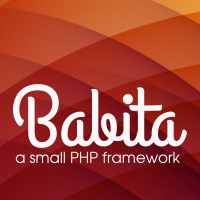

# Release 0.0.1

## What is Babita Framework?

Babita is a [SMVC](https://github.com/simple-mvc-framework/framework) fork with several changes in the core of the Framework and adding new aid classes. Some of the new compontes were written / modified based on CakePHP. The principle of this design is simplicity, always.

## Documentation

Under development

## Requirements

The framework requirements are limited:

- [Apache Web Server](https://httpd.apache.org/) or equivalent with [mod_rewrite](http://httpd.apache.org/docs/current/mod/mod_rewrite.html) support
- [PHP 5.6 or greater](http://php.net/downloads.php) is required

Although a database is not required, if a database is to be used the system is designed to work with a [MySQL database](http://www.mysql.com/). The framework can be changed to work with another database type.

## Installation

1. [Download](https://github.com/codions/babita/archive/master.zip) the framework.
2. Unzip the package.
3. To run [composer](https://getcomposer.org/), navigate to your project on a terminal/command prompt, then run `composer install`. That will update the vendor folder. Or use the vendor folder as is (composer is not required for this step).
Upload the framework files to your server. Normally the `index.php` file will be at your root. Can be placed to the directory public.
4. Open `config/config.php` and set your base path (if the framework is installed in a folder, the base path should reflect the folder path `/path/to/folder/` otherwise a single `/` will do).
5. Open the `config/routes.php` file with a text editor and setup your routes.
6. Edit `.htaccess` file and save the base path (if the framework is installed in a folder, the base path should reflect the folder path `/path/to/folder/` otherwise a single `/` will do).

