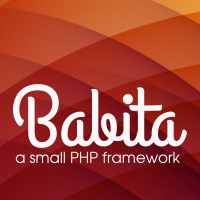

# Version 1.0.0 beta

## What is Babita Framework?

Babita is a [SMVC](https://github.com/simple-mvc-framework/framework) fork with several changes in the core of the Framework and adding new aid classes. Some of the new compontes were written / modified based on CakePHP. The principle of this design is simplicity, always.

## Documentation

Under development

## Requirements

The framework requirements are limited:

- [Apache Web Server](https://httpd.apache.org/) or equivalent with [mod_rewrite](http://httpd.apache.org/docs/current/mod/mod_rewrite.html) support
- [PHP 5.6 or greater](http://php.net/downloads.php) is required

Although a database is not required, if a database is to be used the system is designed to work with a [MySQL database](http://www.mysql.com/). The framework can be changed to work with another database type.
